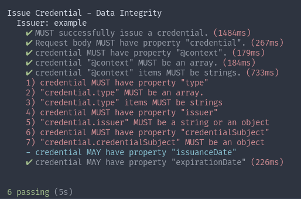

Configurations for your issuer(s) are placed within this folder. Each issuer should correspond to a single config file. The name of the config file will be used as the issuers name in the test output. An example configuration is supplied below.

```js
/**
 * A configuration file should export an object containing id and endpoint.
 */
module.exports = {
  /**
   * This is the id of the issuer instance, usually a DID.
   * @example
   * id: 'did:key:z6MkrHKzgsahxBLyNAbLQyB1pcWNYC9GmywiWPgkrvntAZcj'
   */
  id: '',
  /**.
   * This is the credential issuance endpoint on the issuer. This endpoint
   * should follow the specifications outlined in the VC API. All tests in this
   * test suite will be run against this endpoint.
   * @example
   * endpoint: 'https://your.issuer.com/credentials/issue'
   * @see {@link https://w3c-ccg.github.io/vc-api/|VC API}
   */
  endpoint: ''
};
```

Once your configuration is written, the test suite can be run. Running the test should output the results of each test case against your issuer in the terminal the tests were run out of. Any test case failures will have reasons for failure listed out at the end of the test output.



